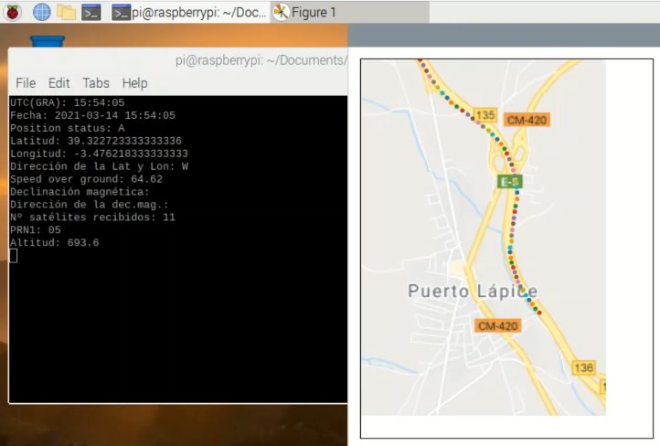
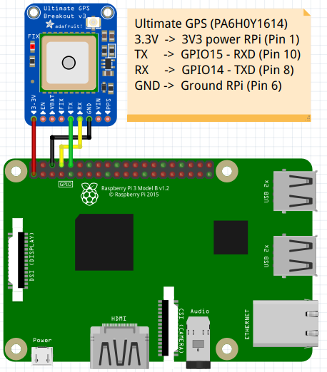

# GPS-navigator

The program waits for the first position and gets the tile from google maps server. Then plots each position received.

[Here's](https://youtu.be/Akg5iG3gInw) the code explanation (spanish).

Serial port should be changed in position.py acording to your device.

### To install pyserial:
sudo python3 -m pip3 install pyserial
### To install pynmea2:
pip3 install pynmea2
### To install cartopy:
brew install proj geos
pip3 install --upgrade cython numpy pyshp six
pip3 install shapely --no-binary shapely
apt-get install libproj-dev libgeos-dev
sudo apt-get install python3-gi-cairo
sudo pip3 install cartopy

*Application developed for the subject 'Aerospace electronics' at the University of Granada Master's Degree in Industrial Electronics. https://masteres.ugr.es/electronicaindustrial/*
